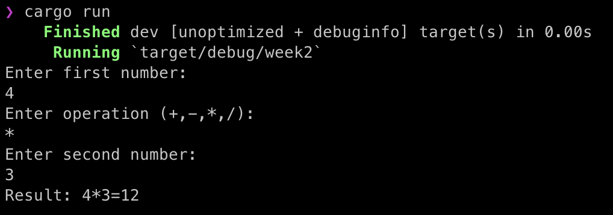

# Polkadot Bootcamp Homework (Week-2)

## A simple calculator using enums and pattern matching

Operation enum created with variants: Add, Subtract, Multiply, Divide. Each operation takes values with the type of f64.
```rust
enum Operation {
    Add(f64,f64),
    Substract(f64,f64),
    Multiply(f64,f64),
    Divide(f64,f64)
}
```
The "calculate" function was created and implemented for each variant. 
> Also checks for zero division error.
```rust
fn calculate (operation: Operation) -> Result<f64, &'static str> {
    match operation {
        Operation::Add(a, b) => Ok(a + b),
        Operation::Substract(a, b) => Ok(a - b),
        Operation::Multiply(a, b) => Ok(a * b),
        Operation::Divide(a, b) => {
            if b != 0.0 {
                Ok(a / b)
            } else {
                Err("Divide by zero error.")
            }
        }
    }
}
```
The "get_input" function was created for getting input from user
```rust
fn get_input(buff:&mut String, prompt:&str) {
    println!("{}", prompt);
    io::stdout().flush().unwrap();
    buff.clear();
    std::io::stdin().read_line(buff).unwrap();
}
```

Finally operation instance will be generated based on given operation symbol. Calculate and print the result with total eqution.
```rust
let operation = match operation_symbol {
        '+' => Operation::Add(first_number, second_number),
        '-' => Operation::Substract(first_number, second_number),
        '*' => Operation::Multiply(first_number, second_number),
        '/' => Operation::Divide(first_number, second_number),
        _ => panic!("Invalid Operation"),
    };
```
```rust
match calculate(operation) {
        Ok(result) => println!("Result: {}{}{}={}", first_number, operation_symbol, second_number, result),
        Err(error) => println!("Error: {}", error)
    }
```

Terminal result
