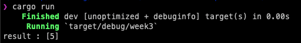

# Polkadot Bootcamp Homework (Week-3)
## Custom Fitering Function in Rust

Filter condition struct created with generic type.
```rust
struct FilterCondition<T> {
    value:T
}
```
The "is_match" function created and implemented to filter condition stuct for checking if struct value and given value are equal or not.
```rust
impl<T: PartialEq> FilterCondition<T> {
    fn is_match(&self, item:&T) -> bool {
        *item == self.value
    }
}
```
Asterisk(*) symbol help us to reach actual value that stored in heap. Therefore, we are comparing the actual values itself rather than pointer. 
<br>
The "custom_filter" function created. Iterate through collection to store match values in filetered collection with spesific condition.

```rust
fn custom_filter<T>(collection: &[T], filter_condition: &FilterCondition<T>) -> Vec<T> where T:PartialEq + Clone {
    
    let mut filtered_collection = Vec::new();

    for item in collection {
        if filter_condition.is_match(item) {
            filtered_collection.push(item.clone());
        }
    }
    filtered_collection

}
```

Finally, using this function and filter in main function

```rust
fn main() {
    
    let collection = vec![1, 5, 3, 6, 9]; // create collection
    let filter_condition = FilterCondition { value: 5}; // create custom filter condition

    let result = custom_filter(&collection, &filter_condition); // get result filter collection

    println!("result : {:?}", result); // print result
}
```

Result in terminal <br>
